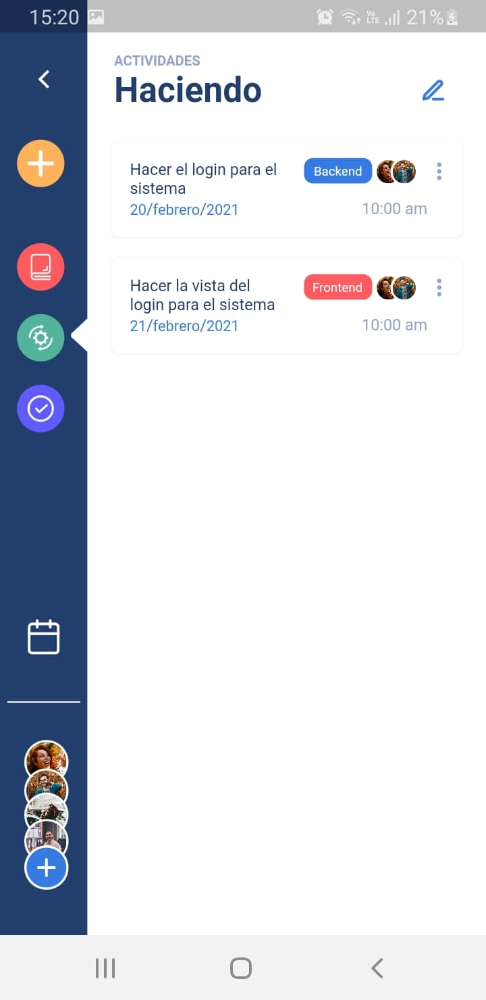

# FLUTTER UI APP

## Movie App

### [Design](https://dribbble.com/shots/10795979-Movie-App-Free)

#### By Nickelfox
- [Dribble](https://dribbble.com/NickelfoxStudio)

### App
<table >
    <tr>
        <th>Movies</th>
        <th>Movie Detail</th>
    </tr>
	<tr>
		<td></td> 
        <td></td>
	</tr>
</table>

## CANVAS

### [Design](https://dribbble.com/shots/14703910-Task-App-Concept-Design)

#### By Mauricio Lopez
- [Dribble](https://dribbble.com/m4st3rmiau)

### App
<table>
    <tr>
        <th>Home</th>
        <th>Canvas</th>
    </tr>
	<tr>
		<td></td> 
        <td></td>
	</tr>
</table>
<table>
    <tr>
        <th>Por Hacer</th>
        <th>Haciendo</th>
        <th>Realizadas</th>
    </tr>
	<tr>
        <td></td>
        <td></td>
        <td></td> 
	</tr>
</table>

## WORKOUT APP

### [Design](https://dribbble.com/shots/14703910-Task-App-Concept-Design)

#### By Mauricio Lopez
- [Dribble](https://dribbble.com/shots/14426401-Workout-App-Concept)

### App
<table>
    <tr>
        <th>Welcome</th>
        <th>About</th>
    </tr>
	<tr>
		<td></td> 
        <td></td>
	</tr>
</table>
<table>
    <tr>
        <th>Home</th>
        <th>Detail</th>
    </tr>
	<tr>
		<td></td> 
        <td></td>
	</tr>
</table>

## DialogFlow in Flutter
### App
<table>
    <tr>
        <th>First Message</th>
        <th>Second Message</th>
    </tr>
	<tr>
		<td></td> 
        <td></td>
	</tr>
</table>
